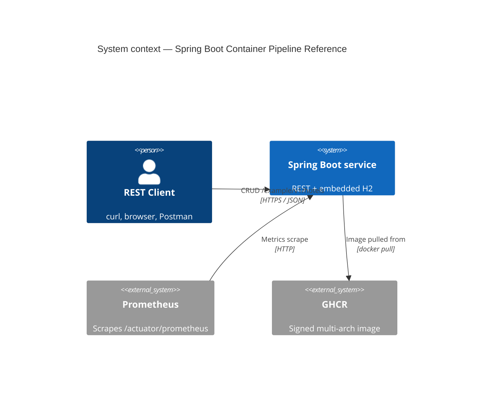
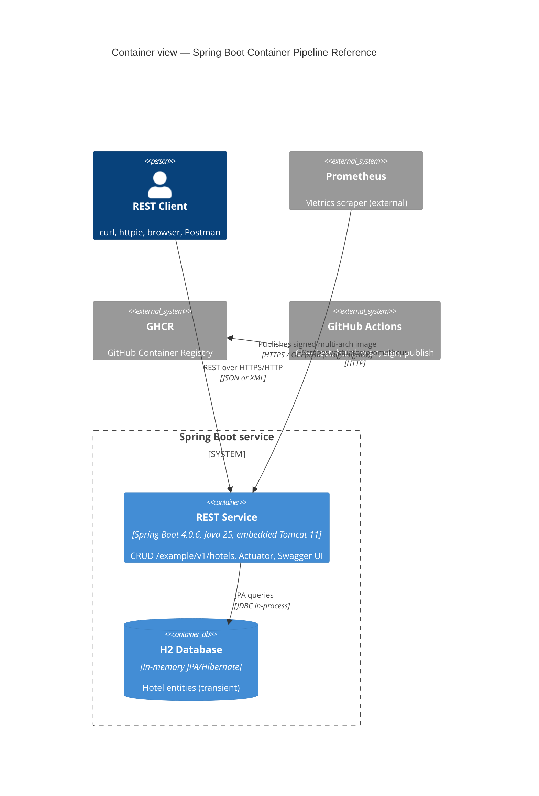
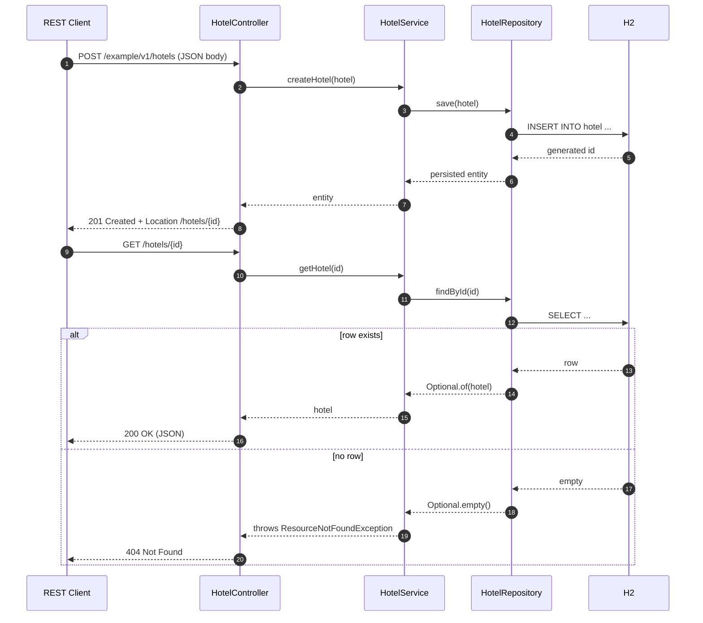

[](https://github.com/AndriyKalashnykov/spring-boot-demo/actions/workflows/ci.yml)
[](https://hits.sh/github.com/AndriyKalashnykov/spring-boot-demo/)
[](https://opensource.org/licenses/MIT)
[](https://app.renovatebot.com/dashboard#github/AndriyKalashnykov/spring-boot-demo)
[](https://github.com/AndriyKalashnykov/spring-boot-demo/releases)

# Spring Boot Container Pipeline Reference

A small Spring Boot REST microservice (hotel CRUD over an in-memory H2) used as a reference for four container image build paths — multi-stage Dockerfile with BuildKit (consuming Spring Boot's layered jar), Cloud Native Buildpacks via the `pack` CLI, Kaniko, and the Spring Boot Maven plugin's `build-image` goal (Paketo). Ships with a hardened GitHub Actions pipeline (Trivy image scan, boot-marker smoke test, multi-arch build, cosign keyless signing to GHCR) and a Skaffold-driven Kubernetes deployment flow. The application is deliberately minimal — the value is in the image, CI, and deployment harness around it.



The container registry is [GHCR (GitHub Container Registry)](https://ghcr.io). Published image: `ghcr.io/andriykalashnykov/spring-boot-demo/app:<semver>` (OCI references are lowercase). Authentication uses `GITHUB_TOKEN` — no separate registry credentials required.

| Component | Technology |
|-----------|-----------|
| Language | Java 25 (Temurin LTS) |
| Framework | Spring Boot 4.0.6 (Spring Framework 7, embedded Tomcat 11) |
| Persistence | Spring Data JPA + Hibernate 7, H2 2.x in-memory |
| API | REST (JSON and XML via Jackson) + springdoc-openapi 3 |
| Metrics | Spring Boot Actuator + Micrometer Prometheus |
| Tests | JUnit 5 + Spring MockMvc + TestRestTemplate (via `spring-boot-resttestclient`) |
| Build | Maven 3.9, multi-stage Dockerfile, Buildpacks, Kaniko, Skaffold |
| Runtime | Container image on GHCR (`ghcr.io/andriykalashnykov/spring-boot-demo/app`); Kubernetes deployment |
| CI | GitHub Actions, Renovate |

## Quick Start

```bash
make deps-install   # install Java 25 + Maven via mise (first run only)
make test           # run unit tests
make run            # start the application on http://localhost:8080
# Open http://localhost:8080/swagger-ui/index.html
```

## Prerequisites

| Tool | Version | Purpose |
|------|---------|---------|
| [GNU Make](https://www.gnu.org/software/make/) | 3.81+ | Build orchestration |
| [Git](https://git-scm.com/) | 2.0+ | Source control |
| [JDK](https://adoptium.net/) | 25 (Temurin LTS) | Java runtime and compiler |
| [Maven](https://maven.apache.org/) | 3.9+ | Build and dependency management |
| [Docker](https://www.docker.com/) | 20.10+ | Image build and local container runs |
| [mise](https://mise.jdx.dev/) | latest | Java/Maven version management |
| [curl](https://curl.se/) | any | HTTP client for smoke testing |
| [jq](https://jqlang.github.io/jq/) | 1.6+ | JSON parsing (optional) |

Install and activate the toolchain:

```bash
make deps-install
```

`make deps-install` installs mise if missing, then reads `.mise.toml` to install the pinned Java and Maven versions. The first run prints an `eval "$(~/.local/bin/mise activate <shell>)"` line to add to your shell rc — after that, `mise` activates automatically on `cd` into the project.

## Architecture

The service is a single Spring Boot jar exposing a REST API for hotel records, backed by an in-memory H2 database. Actuator exposes operational endpoints (health, metrics, Prometheus scrape) on the same port. springdoc-openapi generates an OpenAPI 3 document surfaced through Swagger UI.

### Container view



- **REST Service** — Spring Boot 4.0.6 on Java 25 (Temurin LTS), embedded Tomcat 11; serves `/example/v1/hotels`, Actuator, and Swagger UI on the same port.
- **H2 Database** — in-memory JPA/Hibernate datastore; data is transient and resets on each application restart (intentional for the demo).
- **Prometheus** — scrapes `/actuator/prometheus` over HTTP; no push gateway, no remote write.
- **GHCR** — receives signed multi-arch images from GitHub Actions; consumers verify with `cosign verify` against the workflow's OIDC identity.

### Request flow



- Steps 1–8: standard CRUD POST round-trip — the `Location` header points the client at the new resource.
- Steps 9–17: read-by-id with two outcomes — `Optional.of(hotel)` returns 200, `Optional.empty()` is mapped to `ResourceNotFoundException` by `HotelService` and rendered as `404 Not Found` by `AbstractRestHandler`'s `@ExceptionHandler` (body shape verified by `ErrorEnvelopeIT`).

Image-build variants covered by the repo:

| Path | Dockerfile | Entry point | Notes |
|------|------------|------------|-------|
| Multi-stage Dockerfile + BuildKit | `Dockerfile` | `scripts/build-dockerimage.sh` / `make image-build` | Eclipse Temurin 25 JRE runtime, non-root UID 65532, BuildKit cache mount on `~/.m2`, `COPY --link` on runtime layers. Canonical path; also used by CI |
| Maven + host `~/.m2` cache | `Dockerfile.maven-host-m2-cache` | `scripts/build-dockerimage-m2-cache.sh` | Consumes `target/*.jar` pre-built on the host — run `mvn clean package` (or `make build`) first |
| Cloud Native Buildpacks | — (buildpacks generate the image) | `scripts/build-dockerimage-buildpacks.sh` | `pack build` against pinned `paketobuildpacks/builder-jammy-base` |
| Kaniko | `Dockerfile.maven-host-m2-cache` | `scripts/build-dockerimage-kaniko.sh` | Rootless, daemonless, CI-friendly. Also consumes host-built `target/*.jar` |
| Spring Boot Maven plugin `build-image` | — (Paketo via the plugin) | `scripts/build-dockerimage-maven.sh` | `mvn spring-boot:build-image`; image name comes from `<docker.image.name>` in `pom.xml`, `BP_OCI_SOURCE` set so GHCR auto-links to the repo |

## API

Base path: `/example/v1/hotels`. All endpoints accept and return `application/json` (also `application/xml` for CRUD operations).

| Method | Path | Behaviour |
|--------|------|-----------|
| `POST` | `/example/v1/hotels` | Create a hotel. Returns `201 Created` with `Location` header |
| `GET` | `/example/v1/hotels?page=&size=` | Paginated list |
| `GET` | `/example/v1/hotels/{id}` | Fetch by id. `404` if absent |
| `PUT` | `/example/v1/hotels/{id}` | Update. `204` on success, `400` on path/body id mismatch, `404` if absent |
| `DELETE` | `/example/v1/hotels/{id}` | Delete. `204` on success, `404` if absent |
| `GET` | `/commitid` | Build/commit metadata |

Operational endpoints (Actuator):

| Path | Purpose |
|------|---------|
| `/actuator/health` | Health status (includes custom `HotelServiceHealth`) |
| `/actuator/info` | Build metadata |
| `/actuator/metrics` | Application metrics |
| `/actuator/prometheus` | Prometheus scrape endpoint |
| `/actuator/env` | Environment properties |

API documentation:

| Path | Format |
|------|--------|
| `/swagger-ui/index.html` | Swagger UI |
| `/v3/api-docs` | OpenAPI 3 JSON (served by springdoc-openapi) |

### Example requests

Create a hotel from the sample payload:

```bash
curl -X POST http://localhost:8080/example/v1/hotels \
  -H 'Content-Type: application/json' \
  -H 'Accept: application/json' \
  --data @scripts/hotel.json
```

Retrieve the first page of hotels:

```bash
curl -s 'http://localhost:8080/example/v1/hotels?page=0&size=10' | jq .
```

Open the Swagger UI: <http://localhost:8080/swagger-ui/index.html>.

## Build & Package

### Build the jar

```bash
make build   # produces target/spring-boot-demo-0.0.1.jar
```

Run the packaged jar directly:

```bash
java -jar -Dspring.profiles.active=default target/spring-boot-demo-0.0.1.jar
```

> Under the hood the entrypoint is `org.springframework.boot.loader.launch.JarLauncher` (Spring Boot 3.2+ sub-package); the `-jar` shortcut above dispatches to it automatically.

### Build the Docker image

```bash
make image-build                    # multi-stage Dockerfile via BuildKit
./scripts/build-dockerimage-buildpacks.sh
./scripts/build-dockerimage-kaniko.sh
./scripts/build-dockerimage-m2-cache.sh   # reuses host Maven cache
```

Run the built image locally:

```bash
make image-run       # maps host 8080 -> container 8080
make image-stop
```

## Deployment

### Local Kubernetes (Skaffold)

The repo ships a `skaffold.yaml` that builds the image via Paketo buildpacks. Deploy to any Kubernetes cluster pointed at by your current `kubectl` context:

```bash
skaffold run
skaffold delete
```

### Remote debugging

Start the service with JDWP listening on port 5005:

```bash
mvn clean package spring-boot:run \
  -Dspring-boot.run.jvmArguments="-Xdebug -Xrunjdwp:transport=dt_socket,server=y,suspend=y,address=5005"
```

Or against the packaged jar:

```bash
java -agentlib:jdwp=transport=dt_socket,server=y,suspend=n,address=5005 \
  -Dspring.profiles.active=test -jar target/spring-boot-demo-0.0.1.jar
```

In IntelliJ IDEA: *Run → Edit Configurations → Add → Remote JVM Debug → Port 5005*.


## Available Make Targets

Run `make help` to see the full list.

### Setup & Dependencies

| Target | Description |
|--------|-------------|
| `make help` | List available tasks |
| `make deps` | Verify required tools and provision mise-managed CLIs |
| `make deps-install` | Install Java + Maven via mise (reads `.mise.toml`) |
| `make deps-maven` | Install Maven from Apache archives (CI-container fallback) |
| `make deps-docker` | Verify Docker is installed |
| `make deps-node` | Verify Node.js/npx is available (used by `renovate-validate`) |
| `make deps-check` | Show installation status of every required tool |

### Build & Run

| Target | Description |
|--------|-------------|
| `make build` | Build the jar (skips tests) |
| `make run` | Start the application locally on port 8080 |
| `make clean` | Remove build artifacts |

### Testing

| Target | Description | Runtime |
|--------|-------------|---------|
| `make test` | Unit tests — Spring MockMvc, in-process | seconds |
| `make integration-test` | Integration tests — `*IT.java` via Maven Failsafe, real Tomcat on a random port, H2 backend | tens of seconds |
| `make e2e` | End-to-end smoke — boots the packaged JAR on a kernel-allocated free port, exercises CRUD + Actuator + Swagger via curl | ~10 seconds |

### Code Quality

| Target | Description |
|--------|-------------|
| `make format` | Auto-format Java sources with `google-java-format` |
| `make format-check` | Verify formatting (CI gate) |
| `make lint` | Compiler warnings-as-errors + Checkstyle (`google_checks.xml`, `severity=error`) |
| `make lint-docker` | Lint both Dockerfiles with `hadolint` |
| `make lint-ci` | Lint GitHub Actions workflows with `actionlint` |
| `make lint-scripts-exec` | Verify all `scripts/*.sh` and `e2e/*.sh` are committed with the executable bit set |
| `make mermaid-lint` | Validate Mermaid blocks with pinned `minlag/mermaid-cli` |
| `make trivy-fs` | Scan filesystem for CVEs, secrets, misconfigurations |
| `make secrets` | Scan repo for leaked secrets with `gitleaks` |
| `make cve-check` | OWASP dependency-check vulnerability scan |
| `make deps-prune` | Show declared-but-unused / used-undeclared Maven dependencies |
| `make deps-prune-check` | Fail on any used-undeclared or unused-declared dependency (manual; not in CI — Spring Boot starters create false positives) |
| `make static-check` | Composite gate: format-check, lint, lint-docker, lint-ci, lint-scripts-exec, mermaid-lint, trivy-fs, secrets, deps-prune-check |

### Docker

| Target | Description |
|--------|-------------|
| `make image-build` | Build the Docker image (multi-stage) |
| `make image-test` | Validate image structure (USER, ENTRYPOINT, layered-jar layout) via `container-structure-test` |
| `make image-run` | Run the image locally |
| `make image-stop` | Stop the running container |
| `make image-push` | Push the image to the registry |

### CI

| Target | Description |
|--------|-------------|
| `make ci` | Full local CI pipeline (`static-check` composite gate + test + integration-test + build) |
| `make ci-run` | Run GitHub Actions workflows locally via [act](https://github.com/nektos/act) |
| `make renovate-validate` | Validate `renovate.json` |

### Utilities

| Target | Description |
|--------|-------------|
| `make release` | Create and push a semver release tag (interactive) |

## CI/CD

GitHub Actions runs on push to `main`, pull requests, `v*` tags, manual dispatch, and a weekly schedule (`cve-check` only). A `changes` detector job evaluates the diff via `dorny/paths-filter` — doc-only diffs short-circuit to a green `ci-pass` without triggering heavy jobs (avoids the Repository-Rulesets deadlock that trigger-level `paths-ignore` produces).

| Job | Triggers | Purpose |
|-----|----------|---------|
| `changes` | all | Path filter — gates heavy jobs on code/build/CI changes |
| `static-check` | code diffs | `make static-check` — format-check, lint (Checkstyle), lint-docker, lint-ci, lint-scripts-exec, mermaid-lint, trivy-fs, secrets, deps-prune-check |
| `test` | code diffs | `make test` — JUnit via Spring MockMvc |
| `integration-test` | code diffs | `make integration-test` — `*IT.java` via Maven Failsafe |
| `build` | code diffs | `make build` — packages the jar, uploads as artifact |
| `e2e` | code diffs | `make e2e` — boots the packaged JAR on a free port, curl-based CRUD + Actuator + Swagger smoke |
| `cve-check` | tags + weekly + dispatch | OWASP dependency-check; NVD database cached |
| `docker` | code diffs (build always; push/sign tag-gated at step level) | Build, Trivy scan, smoke-test, container-structure-test, multi-arch (`linux/amd64`+`linux/arm64`) push (tag only), cosign sign (tag only) |
| `ci-pass` | all | Aggregator gate for branch protection |

A separate `Cleanup old workflow runs` workflow prunes old workflow runs and orphaned caches on a weekly schedule (Sunday 00:00 UTC) plus manual dispatch.

Dependency updates are managed by [Renovate](https://docs.renovatebot.com/) with `config:best-practices` and `platformAutomerge: true`.

### Pre-push image hardening

The `docker` job runs these gates **before** any image is pushed to GHCR. Any failure blocks the release.

| # | Gate | Catches | Tool |
|---|------|---------|------|
| 1 | Single-arch scan build | Build regressions, base-image drift | `docker/build-push-action` with `load: true` |
| 2 | Trivy image scan (CRITICAL/HIGH blocking) | Fixed CVEs in base image, OS packages, build layers | `aquasecurity/trivy-action` with `image-ref:` |
| 3 | Spring Boot boot-marker smoke test | Image fails to start (classpath, JVM flags, config) | `docker run` + grep boot marker in logs |
| 4 | container-structure-test | USER/ENTRYPOINT/WORKDIR/exposed-port drift, layered-jar layout regressions | `container-structure-test` against `container-structure-test.yaml` |
| 5 | Build + push | Publishes multi-arch (`linux/amd64`+`linux/arm64`) to GHCR | `docker/build-push-action` with `push: true` |
| 6 | Cosign keyless OIDC signing | Sigstore signature on the manifest digest | `sigstore/cosign-installer` + `cosign sign` |

Buildkit in-manifest attestations (`provenance`, `sbom`) are disabled so the image index stays free of `unknown/unknown` platform entries — this keeps the registry "OS / Arch" tab rendering correctly. Cosign keyless signing provides supply-chain verification.

Verify a published image's signature:

```bash
cosign verify ghcr.io/andriykalashnykov/spring-boot-demo/app:<tag> \
  --certificate-identity-regexp 'https://github\.com/AndriyKalashnykov/spring-boot-demo/.+' \
  --certificate-oidc-issuer https://token.actions.githubusercontent.com
```

### Required Secrets and Variables

| Name | Type | Used by | How to obtain |
|------|------|---------|---------------|
| `NVD_API_KEY` | Secret (optional) | `cve-check` | Free key from [NIST NVD](https://nvd.nist.gov/developers/request-an-api-key). Without it, the OWASP dependency-check still runs but at slower/throttled rates |

The `docker` job authenticates to GHCR using the automatically-scoped `GITHUB_TOKEN` provided by GitHub Actions; cosign keyless signing uses the runner's OIDC identity via Sigstore Fulcio (no signing key material stored anywhere).

Set secrets via **Settings → Secrets and variables → Actions → New repository secret**.

## Contributing

Contributions welcome — open a PR.
