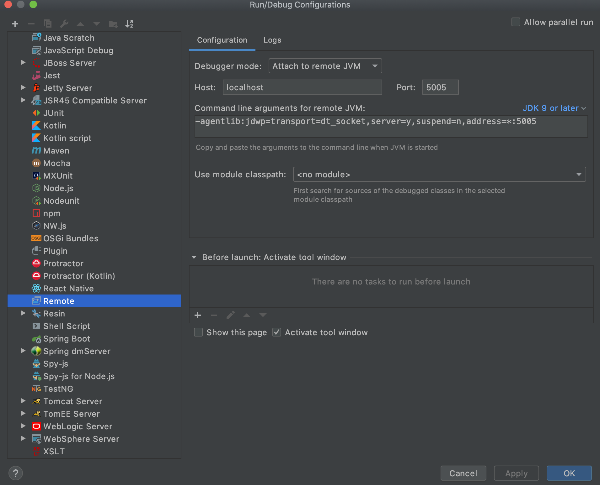

[](https://github.com/AndriyKalashnykov/spring-boot-demo/actions/workflows/ci.yml)
[](https://hits.sh/github.com/AndriyKalashnykov/spring-boot-demo/)
[](https://app.renovatebot.com/dashboard#github/AndriyKalashnykov/spring-boot-demo)

# Spring Boot Demo

Spring Boot 2.3.9 REST microservice exposing CRUD endpoints over an H2 in-memory database. Demonstrates four container image build paths (multi-stage Dockerfile with BuildKit, Cloud Native Buildpacks, Kaniko, Spring Boot layered jar) and a Kubernetes deployment flow via Skaffold.

| Component | Technology |
|-----------|-----------|
| Language | Java 11 (Temurin) |
| Framework | Spring Boot 2.3.9 (Spring Framework 5.x, embedded Tomcat 9) |
| Persistence | Spring Data JPA + Hibernate, H2 in-memory |
| API | REST (JSON and XML) + Springfox 3.0 OpenAPI 3 |
| Metrics | Spring Boot Actuator + Micrometer Prometheus |
| Tests | JUnit 4 + Spring MockMvc |
| Build | Maven 3.9, multi-stage Dockerfile, Buildpacks, Kaniko, Skaffold |
| Runtime | Container image on Docker Hub; Kubernetes deployment |
| CI | GitHub Actions, Renovate |

## Quick Start

```bash
make deps-install   # install Java 11 + Maven via mise (first run only)
make test           # run unit tests
make run            # start the application on http://localhost:8080
# Open http://localhost:8080/swagger-ui/index.html
```

## Prerequisites

| Tool | Version | Purpose |
|------|---------|---------|
| [GNU Make](https://www.gnu.org/software/make/) | 3.81+ | Build orchestration |
| [Git](https://git-scm.com/) | 2.0+ | Source control |
| [JDK](https://adoptium.net/) | 11 (Temurin) | Java runtime and compiler |
| [Maven](https://maven.apache.org/) | 3.9+ | Build and dependency management |
| [Docker](https://www.docker.com/) | 20.10+ | Image build and local container runs |
| [mise](https://mise.jdx.dev/) | latest | Java/Maven version management |
| [curl](https://curl.se/) | any | HTTP client for smoke testing |
| [jq](https://jqlang.github.io/jq/) | 1.6+ | JSON parsing (optional) |

Install and activate the toolchain:

```bash
make deps-install
```

`make deps-install` installs mise if missing, then reads `.mise.toml` to install the pinned Java and Maven versions. The first run prints an `eval "$(~/.local/bin/mise activate <shell>)"` line to add to your shell rc — after that, `mise` activates automatically on `cd` into the project.

## Architecture

The service is a single Spring Boot jar exposing a REST API for hotel records, backed by an in-memory H2 database. Actuator exposes operational endpoints (health, metrics, Prometheus scrape) on the same port. Springfox generates OpenAPI 3 documentation surfaced through Swagger UI.

```
client --> REST (JSON/XML) --> HotelController --> HotelService --> HotelRepository (JPA) --> H2
                               |
                               +--> CommitInfoController (git metadata)
                               +--> Actuator (/actuator/*)
                               +--> Springfox (/v3/api-docs, /swagger-ui/**)
```

Image-build variants covered by the repo:

| Path | Entry point | Notes |
|------|------------|-------|
| Multi-stage Dockerfile + BuildKit | `Dockerfile` / `scripts/build-dockerimage.sh` | Distroless base image, non-root |
| Maven + host `~/.m2` cache | `Dockerfile.maven-host-m2-cache` / `scripts/build-dockerimage-m2-cache.sh` | Reuses host Maven cache for faster local iteration |
| Cloud Native Buildpacks | `scripts/build-dockerimage-buildpacks.sh` | `pack build` via Paketo |
| Kaniko | `scripts/build-dockerimage-kaniko.sh` | Rootless, CI-friendly |

## API

Base path: `/example/v1/hotels`. All endpoints accept and return `application/json` (also `application/xml` for CRUD operations).

| Method | Path | Behaviour |
|--------|------|-----------|
| `POST` | `/example/v1/hotels` | Create a hotel. Returns `201 Created` with `Location` header |
| `GET` | `/example/v1/hotels?page=&size=` | Paginated list |
| `GET` | `/example/v1/hotels/{id}` | Fetch by id. `404` if absent |
| `PUT` | `/example/v1/hotels/{id}` | Update. `204` on success, `400` on path/body id mismatch, `404` if absent |
| `DELETE` | `/example/v1/hotels/{id}` | Delete. `204` on success, `404` if absent |
| `GET` | `/commitid` | Build/commit metadata |

Operational endpoints (Actuator):

| Path | Purpose |
|------|---------|
| `/actuator/health` | Health status (includes custom `HotelServiceHealth`) |
| `/actuator/info` | Build metadata |
| `/actuator/metrics` | Application metrics |
| `/actuator/prometheus` | Prometheus scrape endpoint |
| `/actuator/env` | Environment properties |

API documentation:

| Path | Format |
|------|--------|
| `/swagger-ui/index.html` | Swagger UI |
| `/v3/api-docs` | OpenAPI 3 JSON |

### Example requests

Create a hotel from the sample payload:

```bash
curl -X POST http://localhost:8080/example/v1/hotels \
  -H 'Content-Type: application/json' \
  -H 'Accept: application/json' \
  --data @hotel.json
```

Retrieve the first page of hotels:

```bash
curl -s 'http://localhost:8080/example/v1/hotels?page=0&size=10' | jq .
```

Open the Swagger UI:

```
http://localhost:8080/swagger-ui/index.html
```

## Build & Package

### Build the jar

```bash
make build   # produces target/spring-boot-demo-1.0.0.jar
```

Run the packaged jar directly:

```bash
java -jar -Dspring.profiles.active=default target/spring-boot-demo-1.0.0.jar
```

### Build the Docker image

```bash
make image-build                    # multi-stage Dockerfile via BuildKit
./scripts/build-dockerimage-buildpacks.sh
./scripts/build-dockerimage-kaniko.sh
./scripts/build-dockerimage-m2-cache.sh   # reuses host Maven cache
```

Run the built image locally:

```bash
make image-run       # maps host 8080 -> container 8080
make image-stop
```

## Deployment

### Local Kubernetes (Skaffold)

The repo ships a `skaffold.yaml` that builds the image via Paketo buildpacks. Deploy to any Kubernetes cluster pointed at by your current `kubectl` context:

```bash
skaffold run
skaffold delete
```

### Remote debugging

Start the service with JDWP listening on port 5005:

```bash
mvn clean package spring-boot:run \
  -Drun.jvmArguments="-Xdebug -Xrunjdwp:transport=dt_socket,server=y,suspend=y,address=5005"
```

Or against the packaged jar:

```bash
java -agentlib:jdwp=transport=dt_socket,server=y,suspend=n,address=5005 \
  -Dspring.profiles.active=test -jar target/spring-boot-demo-1.0.0.jar
```

In IntelliJ IDEA: *Run → Edit Configurations → Add → Remote JVM Debug → Port 5005*.



## Available Make Targets

Run `make help` to see the full list.

### Build & Run

| Target | Description |
|--------|-------------|
| `make build` | Build the jar (skips tests) |
| `make test` | Run unit tests |
| `make run` | Start the application locally on port 8080 |
| `make clean` | Remove build artifacts |

### Code Quality

| Target | Description |
|--------|-------------|
| `make format` | Auto-format Java sources with `google-java-format` |
| `make format-check` | Verify formatting (CI gate) |
| `make lint` | Compiler warnings-as-errors |
| `make lint-docker` | Lint both Dockerfiles with `hadolint` |
| `make static-check` | Composite gate: format-check, lint, lint-docker, trivy-fs, secrets |

### Security

| Target | Description |
|--------|-------------|
| `make trivy-fs` | Scan filesystem for CVEs, secrets, misconfigurations |
| `make secrets` | Scan repo for leaked secrets with `gitleaks` |
| `make cve-check` | OWASP dependency-check vulnerability scan |

### Docker

| Target | Description |
|--------|-------------|
| `make image-build` | Build the Docker image (multi-stage) |
| `make image-run` | Run the image locally |
| `make image-stop` | Stop the running container |
| `make image-push` | Push the image to the registry |

### CI

| Target | Description |
|--------|-------------|
| `make ci` | Full local CI pipeline (format-check + lint + test + build) |
| `make ci-run` | Run GitHub Actions workflows locally via [act](https://github.com/nektos/act) |
| `make renovate-validate` | Validate `renovate.json` |

### Utilities

| Target | Description |
|--------|-------------|
| `make integration-test` | Run integration tests (requires Failsafe profile in `pom.xml` — not yet configured) |
| `make release` | Create and push a semver release tag (interactive) |

## CI/CD

GitHub Actions runs on every push to `main`, pull requests, `v*` tags, and manual dispatch.

| Job | Triggers | Purpose |
|-----|----------|---------|
| `test` | all | `make test` — JUnit via Spring MockMvc |
| `build` | all | `make build` — packages the jar, uploads as artifact |
| `docker` | push / dispatch only | Build and push Docker image to Docker Hub |
| `ci-pass` | all | Aggregator gate for branch protection |

A separate `Cleanup` workflow prunes old workflow runs and caches on a weekly schedule (Sunday 00:00 UTC) plus manual dispatch.

Dependency updates are managed by [Renovate](https://docs.renovatebot.com/) with `config:best-practices` and `platformAutomerge: true`.

### Required Secrets and Variables

| Name | Type | Used by | How to obtain |
|------|------|---------|---------------|
| `DOCKERHUB_USERNAME` | Secret | `docker` job | Docker Hub username |
| `DOCKERHUB_TOKEN` | Secret | `docker` job | Docker Hub → Account Settings → Security → New Access Token |

Set secrets via **Settings → Secrets and variables → Actions → New repository secret**.

## Contributing

Contributions welcome — open a PR.
