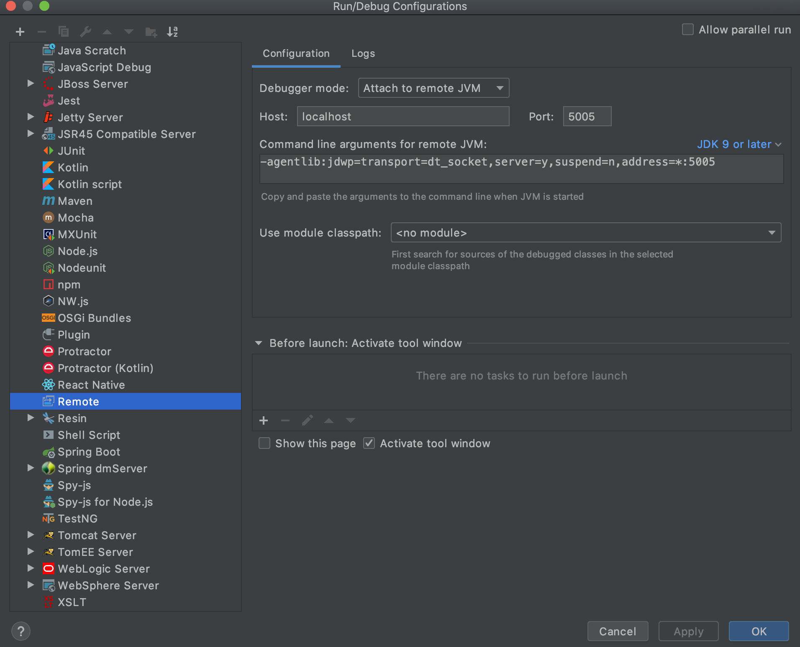

[](https://github.com/AndriyKalashnykov/spring-boot-demo/actions?query=workflow%3Atest)
[](https://github.com/AndriyKalashnykov/spring-boot-demo/actions?query=workflow%3Aci)
[](https://hits.sh/github.com/AndriyKalashnykov/spring-boot-demo/)
# Spring Boot REST microservice

Java / Maven / Spring Boot microservice / Docker image / Buildkit / Buildpacks / Kaniko / Skaffold/ K8s Deployment / Minikube

* Full integration with the latest **Spring** Framework 2.x.x: inversion of control, dependency injection, etc.
* Packaging as a single jar with embedded container (tomcat 8)
* Demonstrates how to set up healthcheck, metrics, info, environment, etc. endpoints automatically on a configured port. Inject your own health / metrics info with a few lines of code.
* RESTful service using annotation: supports both XML and JSON request / response
* Exception mapping from application exceptions to the right HTTP response with exception details in the body
* *Spring Data* Integration with JPA/Hibernate / MongoDB
* CRUD functionality with H2 in-memory data source using Spring *Repository* pattern
* MockMVC test framework
* Self-documented APIs: Swagger2 using annotations
* Buildkit
* Buildpacks
* Kaniko
* Skaffold
* K8s Deployment / Minikube

## Pre-requisites

- [sdkman](https://sdkman.io/install)

    Install OpenJDK 11.x
    
    ```shell
    sdk install java 11.0.11.hs-adpt
    sdk default java 11.0.11.hs-adpt
    sdk use java 11.0.11.hs-adpt
    ```
- [Apache Maven](https://maven.apache.org/install.html)
- [Docker](https://docs.docker.com/engine/install/)
- [Virtualbox](https://www.virtualbox.org/manual/ch02.html)  
- [Minikube](https://kubernetes.io/docs/tasks/tools/install-minikube/)
- [kubectl](https://kubernetes.io/docs/tasks/tools/install-kubectl/)
- [Buildpacks.io](https://buildpacks.io/docs/tools/pack/)  
- [curl](https://help.ubidots.com/en/articles/2165289-learn-how-to-install-run-curl-on-windows-macosx-linux)
- [httpie](https://httpie.org/doc#installation)  
- [jq](https://github.com/stedolan/jq/wiki/Installation)
- [xmllint](https://command-not-found.com/xmllint)

## Build and Run

This application is packaged as a jar which has Tomcat 8 embedded.

* Clone this repository
  
```shell
git clone git@github.com:AndriyKalashnykov/spring-boot-demo.git
cd spring-boot-demo
```

* Build the project and run the service

```shell
  mvn clean package spring-boot:run -Drun.arguments="spring.profiles.active=default" -DskipTests
```
  
or

```
  mvn clean package
  java -jar -Dspring.profiles.active=default target/spring-boot-demo-1.0.jar
```

### Application health, configurations, Git commit info, documentation links

```shell
http://localhost:8080/actuator/info
http://localhost:8080/actuator/health
http://localhost:8080/actuator/env
http://localhost:8080/actuator/health/hotelServiceHealth
http://localhost:8080/actuator/metrics

http://localhost:8080/commitid?mediaType=json

http://localhost:8080/v2/api-docs
http://localhost:8080/swagger-ui/index.html
```

### Microservice API

```shell
curl -X POST 'http://localhost:8080/example/v1/hotels' --header 'Content-Type: application/json' --header 'Accept: application/json' --data @hotel.json --stderr -
```

or

```shell
http POST 'http://localhost:8080/example/v1/hotels' < hotel.json
```

or

```shell
curl -X POST 'http://localhost:8080/example/v1/hotels' --header 'Content-Type: application/json' --header 'Accept: application/json' -d '{"name":"Beds R Us","description":"Very basic, small rooms but clean","city":"Santa Ana","rating":2}' --stderr -
```

### Retrieve paginated list of hotels

```shell
curl -X GET --silent 'http://localhost:8080/example/v1/hotels?page=0&size=10&mediaType=json' --stderr -  2>&1 | jq .
```

or

```shell
http  'http://localhost:8080/example/v1/hotels?page=0&size=10&mediaType=json'
```

### Swagger 2 API docs

```shell
open -a /Applications/Google\ Chrome.app http://localhost:8080/swagger-ui/index.html
```

### Building docker image

#### Optional, local test only: Using local maven cache

In order to build image quickly by compiling maven project using host OS  maven repo

Build project, artifact will be placed in "$PWD"/target

```shell
cd spring-boot-demo
docker run -v ~/.m2:/root/.m2 -v "$PWD":/usr/src -w /usr/src maven:3-jdk-11 mvn clean package
```

#### Build multi-stage image with BuildKit

Docker Build enhancements for 18.09 release introduces a 
much-needed overhaul of the build architecture. 
By integrating BuildKit, users should see an improvement on 
performance, storage management, feature functionality, 
and security.

```shell
cd spring-boot-demo
docker rm -f spring-boot-demo
DOCKER_BUILDKIT=1 docker build  -f Dockerfile -t spring-boot-demo .
```
#### Login to Image Registry

```shell
# provide image registry login and password
DOCKER_LOGIN=
DOCKER_PWD=
docker login --username $DOCKER_LOGIN --password $DOCKER_PWD docker.io
```

#### Build image with Buildpacks

```shell
./scripts/build-dockerimage-buildpacks.sh
```

#### Build image with Kaniko

```shell
./scripts/build-dockerimage-kaniko.sh
```

#### Test application

```shell
cd ./scripts
# adding 100 to port number to avoid local conflicts: 8081->8181
docker run --rm --name spring-boot-demo -p 8080:8080 -p 8181:8081 spring-boot-demo:latest

curl -X POST 'http://localhost:8080/example/v1/hotels' --header 'Content-Type: application/json' --header 'Accept: application/json' --data @hotel.json --stderr -
curl -X GET --silent 'http://localhost:8080/example/v1/hotels?page=0&size=10' --stderr -  2>&1 | jq .
```

### Attaching to the application from IDE

Run the service with these command line options:

```shell
mvn clean package spring-boot:run -Drun.jvmArguments="-Xdebug -Xrunjdwp:transport=dt_socket,server=y,suspend=y,address=5005"
```

or

```shell
java -agentlib:jdwp=transport=dt_socket,server=y,suspend=n,address=5005 -Dspring.profiles.active=test -Ddebug -jar target/spring-boot-demo-1.0.jar
```

IntelliJ : Run -> Edit configuration -> Remote.



### Deploy application to K8s

```shell
minikube delete --all
minikube start -p minikube --memory=16384 --cpus=6 --disk-size=30g --vm-driver=virtualbox
eval $(minikube docker-env)
eval "$(docker-machine env -u)"
# minikube start --vm-driver=virtualbox --extra-config=apiserver.anonymous-auth=false --insecure-registry=localhost:5000

mvn clean package -DskipTests -Pk8s fabric8:undeploy
mvn clean package -Pk8s fabric8:deploy

minikube ssh 'docker logs $(docker ps -a -f name=k8s_kube-api --format={{.ID}})'
```

### Deploy application to k8s overriding runtime JDK/JRE

```shell
mvn clean package fabric8:deploy -Dfabric8.generator.from=fabric8/java-alpine-openjdk11-jdk
```

### Test application deployed on K8s

```shell
curl -X POST --header 'Content-Type: application/json' --header 'Accept: application/json' --data @hotel.json $(minikube service spring-boot-rest-example --url | sed -n 1p)/example/v1/hotels
http $(minikube service spring-boot-demo --url | sed -n 1p)/example/v1/hotels?page=0&size=10

http $(minikube service spring-boot-demo --url | sed -n 2p)/swagger-ui/index.html
http $(minikube service spring-boot-demo --url | sed -n 2p)/info
http $(minikube service spring-boot-demo --url | sed -n 2p)/health
```

### Monitor K8s resources

```shell
kubectl get nodes --no-headers | awk '{print $1}' | xargs -I {} sh -c 'echo {}; kubectl describe node {} | grep Allocated -A 5 | grep -ve Event -ve Allocated -ve percent -ve -- ; echo'
kubectl top pod --all-namespaces
```

### TODO

* Add Spring multi-layer support for the Docker image, be aware of the issue- https://github.com/docker/build-push-action/issues/79
* Add GitHub workflow - see https://github.com/CodigoPraTodos/cursospratodos/blob/master/.github/workflows/ci-api.yml
